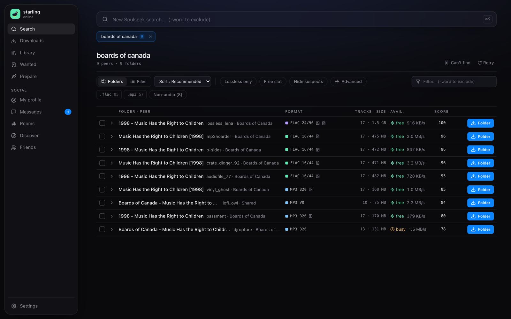
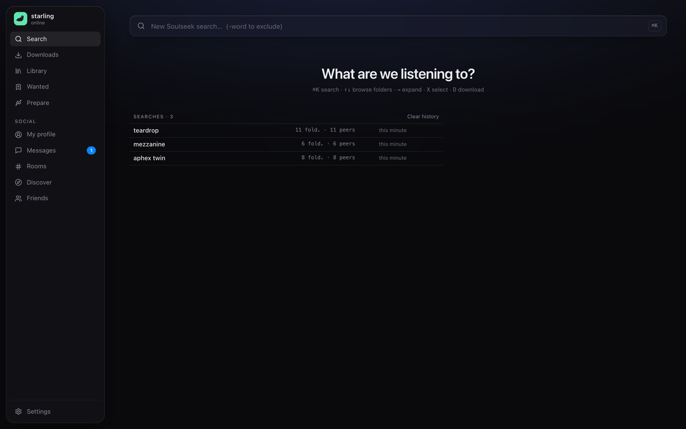

<p align="center">
  
</p>

<h1 align="center">Starling</h1>

<p align="center">
  A desktop app to dig, collect and prepare music from the Soulseek network.<br>
  <sub>Une app pour fouiller, collecter et préparer de la musique sur le réseau Soulseek.</sub>
</p>

<p align="center">
  <a href="https://github.com/b0w3rb1rd/starling-releases/releases/latest"><b>⬇ Download the latest version · Télécharger la dernière version</b></a><br>
  <sub>macOS · Windows · Linux — free, with automatic updates</sub>
</p>

<p align="center">
  
</p>

---

## Features

| | |
|---|---|
| 🔎 **Search** | Results by folder or by file, each peer's quality and availability at a glance, filters, tabs and history. |
| 🎧 **Listen** | Preview tracks before downloading them; player with waveform. |
| 📚 **Library** | Your downloads with their tags and covers. |
| 🔖 **Wanted** | Tracks you're still looking for, re-checked automatically until someone shares them. |
| 🧭 **Discover** | Peers with a similar taste, and what they have that you don't. |
| 🎛 **Prepare** | BPM and key analysis, export to a USB drive, rekordbox XML. |
| 💬 **Social** | Messages, rooms, friends, your profile, and locked shares reserved for friends. |

English and French interface. Starling uses [sillon](https://github.com/b0w3rb1rd/sillon), a modified version of slskd, as its Soulseek engine.

<p align="center">
  
</p>

---

## Download · Télécharger

Pick the file for your computer in the [latest release](https://github.com/b0w3rb1rd/starling-releases/releases/latest):

| Your computer · Ton ordinateur | File · Fichier |
|---|---|
| **Mac with Apple chip** (M1, M2, M3, M4…) | `Starling_x.y.z_macOS_Apple-Silicon.dmg` |
| **Mac with Intel processor** | `Starling_x.y.z_macOS_Intel.dmg` |
| **Windows 10 / 11** | `Starling_x.y.z_Windows_x64-setup.exe` |
| **Linux** | `Starling_x.y.z_Linux_x86_64.AppImage` or `.deb` |

<details>
<summary><b>Which Mac do I have? · Quel Mac ai-je ?</b></summary>

Apple menu › **About This Mac**. A **Chip** line (Apple M1, M2…) means Apple Silicon; a **Processor** line (Intel Core…) means Intel.
Menu Pomme › **À propos de ce Mac** : une ligne **Puce** = Apple Silicon, une ligne **Processeur** = Intel.
</details>

The `_update` archives, `latest.json` and « Source code » are used by automatic updates or added by GitHub: ignore them.

---

## Install · Installer

### macOS

1. Open the `.dmg` and drag **Starling** into **Applications**.
2. Starling isn't signed by Apple, so macOS blocks it the first time: open it once, click **Done**, then go to **System Settings › Privacy & Security** and click **Open Anyway**.
3. If macOS says the app « is damaged », paste this in Terminal:
   ```
   xattr -dr com.apple.quarantine /Applications/Starling.app
   ```

<sub>FR : glisse Starling dans Applications, ouvre-la une fois, clique sur <b>Terminé</b>, puis <b>Réglages système › Confidentialité et sécurité › Ouvrir quand même</b>.</sub>

### Windows

Run the `-setup.exe`. If SmartScreen appears: **More info › Run anyway**.

### Linux

- **AppImage**: `chmod +x Starling_*.AppImage`, then run it. Updates are automatic.
- **Debian / Ubuntu**: `sudo apt install ./Starling_*.deb` (no automatic updates).

---

## First steps

1. Sign in with your Soulseek username and password. No account yet? Choose a free username and a password: the account is created on first sign-in.
2. Pick your downloads folder, then search.
3. Share a folder in **My profile**: many peers refuse downloads from users who share nothing.

A Soulseek account can only be connected in one place at a time: quit SoulseekQt or other clients before using Starling.
